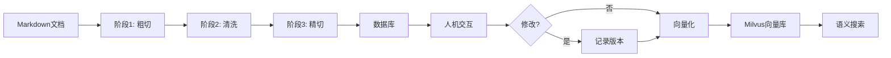

# HIT-RAG: Human-in-the-Loop RAG 系统

一个融合人类反馈的智能文档处理和检索增强生成系统，将轻量级人机交互嵌入到检索流水线的必要环节。

## ✨ 核心特性

- **🔄 人机协同闭环**：可视化界面实时编辑和审核文档切片，每次修改自动记录版本历史
- **🎯 精确检索管道**：三阶段智能预处理流水线，确保 Token 级别的绝对定位和语义完整性
- **🏷️ 灵活标签系统**：支持人工标签和 AI 推理标签，全局标签管理（合并、重命名、删除）
- **🚀 生产级向量化**：异步批处理，支持 Milvus + 多种 Embedding 提供商（Ollama/Azure/OpenAI）
- **📊 完整审计追踪**：所有操作记录到数据库，支持版本回溯和变更对比
- **⚡ 低延迟架构**：FastAPI 后端 + Vue.js 前端，响应式交互体验

## 🏗️ 系统架构

HIT-RAG 采用**前后端分离**设计，包含两个核心模块：

### 📦 后端系统 (`hit-rag`)

**三阶段预处理流水线**：

1. **阶段1：基线建立与粗切** (`stage1_baseline.py`)
   - 建立 Token 绝对索引基线（使用 tiktoken 0.5.2）
   - 按句子边界粗切成 Mid-Chunks（不超过 1536 字符）
   - 保留特殊结构（代码块、表格）的完整性

2. **阶段2：智能清洗与 Token 映射** (`stage2_clean_map.py`)
   - 使用 LLM 标记版式杂质（页眉、页脚、版权等）
   - 移除杂质并提取标签
   - 执行反向 Token 映射，维护绝对索引

3. **阶段3：精细切分与最终定位** (`stage3_refine_locate.py`)
   - 使用 LLM 进行语义驱动的精细切分
   - 计算最终切块的 Token 绝对索引（支持 300-2000 Tokens 可配置）
   - 验证 Token 范围并输出结果

**API 服务** (`api_server.py`)：
- **文档管理**：列表、状态查询、后台处理触发
- **Chunk 编辑**：内容修改、状态管理、版本历史追溯
- **标签管理**：文档级标签、全局标签操作（合并/重命名/删除）
- **向量化管理**：批量/单个向量化、删除向量、统计信息
- **语义搜索**：基于 Milvus 的向量相似度搜索
- **审计日志**：所有操作自动记录

**数据库** (`database.py` + `schema.sql`)：
- **SQLite** 本地存储（支持升级到 PostgreSQL）
- **4 个核心表**：
  - `documents`: 文档元数据
  - `document_chunks`: 切片内容和位置信息
  - `document_logs`: 操作日志（含版本历史）
  - `document_tags`: 文档级标签
- **版本管理**：自动递增版本号，触发器更新时间戳
- **状态跟踪**：`-1=废弃, 0=初始, 1=已确认, 2=已向量化`

**向量存储** (`vector_db/`)：
- **Milvus** 向量数据库（支持 HNSW 索引）
- **Embedding 服务**：Ollama / Azure OpenAI / OpenAI
- **批量异步向量化**：可配置并发数和批次大小
- **元数据过滤**：支持标签、文档名等过滤条件

### 🎨 前端系统 (`hit-rag-ui`)

基于 **Vue 3 + Vite** 的可视化界面：

- **文档面板** (`DocumentPanel.vue`)：浏览所有文档和处理状态
- **Chunk 浏览器** (`ChunksPanel.vue`)：分页展示所有切片
- **Chunk 编辑器** (`ChunkEditor.vue`)：实时编辑内容，支持 Markdown 预览
- **版本历史** (`ChunkVersionHistory.vue`)：查看所有修改记录，版本对比
- **标签管理器** (`TagManager.vue` + `GlobalTagManager.vue`)：添加/删除标签，全局操作
- **语义搜索** (`SemanticSearch.vue`)：基于向量相似度的智能检索
- **Diff 高亮** (`diffHighlight.js`)：可视化展示内容变更

## 📋 项目结构

```
hit-rag/                           # 后端系统
├── main.py                        # 命令行入口：文档预处理
├── api_server.py                  # FastAPI 服务器：REST API
├── config.py                      # 配置文件：LLM/向量化/切分参数
├── database.py                    # 数据库操作封装
├── schema.sql                     # SQLite 数据库 Schema
├── env.template                   # 环境变量模板
├── processing_stages/             # 三阶段预处理流水线
│   ├── stage1_baseline.py         #   阶段1：基线与粗切
│   ├── stage2_clean_map.py        #   阶段2：清洗与映射
│   └── stage3_refine_locate.py    #   阶段3：精细切分
├── llm_api/                       # LLM 集成
│   ├── llm_client.py              #   LLM 客户端（Azure/OpenAI）
│   └── prompt_templates.py        #   Prompt 模板
├── tokenizer/                     # Tokenizer 封装
│   ├── tokenizer_client.py        #   tiktoken 封装
│   └── token_mapper.py            #   Token 映射逻辑
└── vector_db/                     # 向量化模块
    ├── embedding_service.py       #   Embedding 生成
    ├── vector_store.py            #   Milvus 向量存储
    └── vectorization_manager.py   #   向量化业务逻辑

hit-rag-ui/                        # 前端系统
├── src/
│   ├── App.vue                    # 主应用
│   ├── components/                # Vue 组件
│   │   ├── DocumentPanel.vue     #   文档管理
│   │   ├── ChunksPanel.vue       #   切片浏览
│   │   ├── ChunkEditor.vue       #   切片编辑
│   │   ├── ChunkVersionHistory.vue # 版本历史
│   │   ├── TagManager.vue        #   标签管理
│   │   └── SemanticSearch.vue    #   语义搜索
│   ├── composables/               # Vue Composables
│   │   ├── useHighlight.js       #   高亮逻辑
│   │   └── useTags.js            #   标签状态管理
│   └── utils/                     # 工具函数
│       ├── config.js              #   API 配置
│       └── diffHighlight.js      #   Diff 高亮算法
└── public/output/                 # 输出目录（JSON 文件）
```

## 🚀 快速开始

### 1. 环境准备

**系统要求**：
- Python 3.10+
- Node.js 16+
- Milvus 2.3+（可选，用于向量化）

### 2. 后端安装

```bash
# 克隆仓库
git clone https://github.com/cottagephilosopher/hit-rag.git
cd ./hit-rag

# 安装依赖（使用 uv 或 pip）
uv sync
# 或
pip install -e .

# 配置环境变量
cp env.template .env
# 编辑 .env 文件，填入必要配置
```

**必填配置** (`.env`)：

```bash
# LLM 配置（二选一）
LLM_PROVIDER=azure
AZURE_OPENAI_API_KEY=your-api-key
AZURE_OPENAI_ENDPOINT=https://your-endpoint.openai.azure.com/
AZURE_OPENAI_DEPLOYMENT=gpt-4

# 或使用 OpenAI
# LLM_PROVIDER=openai
# OPENAI_API_KEY=your-api-key

# 向量化配置（可选）
MILVUS_HOST=127.0.0.1
MILVUS_PORT=19530
EMBEDDING_PROVIDER=ollama
OLLAMA_BASE_URL=http://localhost:11434
OLLAMA_EMBEDDING_MODEL=qwen3-embedding:latest
```

### 3. 前端安装

```bash
# 克隆仓库
git clone https://github.com/cottagephilosopher/hit-rag-ui.git

cd ./hit-rag-ui

# 安装依赖
npm install

# 启动开发服务器
npm run dev
```

### 4. 启动服务

**启动后端 API**：
```bash
cd ./hit-rag
uv run api_server.py
# API 服务运行在 http://localhost:8086
```

**启动前端界面**：
```bash
cd ./hit-rag-ui
npm run dev
# 前端运行在 http://localhost:3000
```

### API 接口

访问 `http://localhost:8086/docs` 查看完整的 API 文档（Swagger UI）。

**核心接口**：

| 端点 | 方法 | 功能 |
|------|------|------|
| `/api/documents` | GET | 列出所有文档 |
| `/api/documents/{filename}/process` | POST | 触发文档处理 |
| `/api/documents/{filename}/chunks` | GET | 获取文档的所有切片 |
| `/api/chunks/{chunk_id}` | PATCH | 更新切片内容 |
| `/api/chunks/{chunk_id}/logs` | GET | 获取版本历史 |
| `/api/chunks/vectorize/batch` | POST | 批量向量化 |
| `/api/chunks/search` | POST | 语义搜索 |
| `/api/tags/all` | GET | 获取所有标签统计 |
| `/api/tags/merge` | POST | 合并标签 |

### 前端操作流程

1. **文档处理**：
   - 在文档面板选择 `.md` 文件
   - 点击"处理"按钮，后台执行三阶段流水线
   - 查看处理状态（processing → completed）

2. **人机交互**：
   - 浏览生成的切片
   - 编辑不准确的内容
   - 添加或修改标签
   - 标记废弃的切片（状态 → -1）

3. **向量化**：
   - 选择已确认的切片
   - 批量向量化到 Milvus
   - 查看向量化统计

4. **语义搜索**：
   - 输入查询文本
   - 查看相似度排序的结果
   - 根据标签过滤

## 🔧 配置说明

主要配置项在 `config.py` 中：

### LLM 配置

```python
class LLMConfig:
    PROVIDER = "azure"              # azure | openai
    TEMPERATURE = 0.1               # 温度参数
    MAX_RETRIES = 3                 # 最大重试次数
```

### Tokenizer 配置

```python
class TokenizerConfig:
    ENCODING_NAME = "cl100k_base"   # GPT-4 编码
    TIKTOKEN_VERSION = "0.5.2"      # 锁定版本（重要！）
```

### 切分参数

```python
class ChunkConfig:
    MID_CHUNK_MAX_CHARS = 1536      # 阶段1：粗切最大字符数
    FINAL_MIN_TOKENS = 300          # 阶段3：最小 Token 数
    FINAL_TARGET_TOKENS = 800       # 阶段3：目标 Token 数
    FINAL_MAX_TOKENS = 2000         # 阶段3：最大 Token 数
    FINAL_HARD_LIMIT = 3000         # 阶段3：硬性上限
    ATOMIC_MAX_TOKENS = 4000        # ATOMIC 块最大 Token 数,（超出emebedding模型部分计划外挂，暂未实现）
```

### 向量化配置

```python
class VectorConfig:
    MILVUS_HOST = "127.0.0.1"
    MILVUS_PORT = "19530"
    EMBEDDING_PROVIDER = "ollama"   # ollama | azure | openai
    OLLAMA_EMBEDDING_MODEL = "qwen3-embedding:latest"
    BATCH_SIZE = 20                 # 批量向量化大小
    INDEX_TYPE = "HNSW"             # FLAT | IVF_FLAT | HNSW
    METRIC_TYPE = "L2"              # L2 | IP | COSINE
```

## 📊 输出格式

系统生成的 JSON 文件格式：

```json
{
  "metadata": {
    "source_file": "example.md",
    "processed_at": "2024-01-01T12:00:00",
    "total_chunks": 10,
    "statistics": {
      "total_tokens": 5000,
      "avg_tokens": 500,
      "min_tokens": 300,
      "max_tokens": 1200
    }
  },
  "chunks": [
    {
      "chunk_id": 1,
      "content": "文档内容...",
      "token_start": 0,
      "token_end": 500,
      "token_count": 500,
      "char_start": 0,
      "char_end": 1024,
      "user_tag": "技术文档",
      "content_tags": ["RAG", "检索", "生成"],
      "is_atomic": false,
      "atomic_type": null
    }
  ]
}
```

## 🎯 工作流程示例

### 端到端处理流程



### 人机交互价值

**传统 RAG 问题**：
- 切片边界不合理（句子截断）
- 包含版式杂质（页眉/页脚）
- 标签不准确或缺失
- 无法处理特殊格式（表格/代码）

**HIT-RAG 解决方案**：
- ✅ 人工调整切片边界
- ✅ 手动删除杂质或废弃切片
- ✅ 添加/修正标签
- ✅ 完整审计追踪

## 🔍 核心技术

### Token 绝对定位

使用 **tiktoken 0.5.2** 确保 Token 索引的一致性：
- 建立原文的绝对 Token 索引基线
- LLM 清洗后执行反向映射
- 最终切片保留准确的 `token_start` 和 `token_end`

### 反向 Token 映射

```python
# 示例：从清洗后的文本映射回原始位置
original_tokens = [1, 2, 3, 4, 5, 6, 7, 8]  # 原文
cleaned_text = "去除杂质后的文本"
cleaned_tokens = tokenizer.encode(cleaned_text)

# TokenMapper 计算映射关系
mapper = TokenMapper(tokenizer)
token_start, token_end = mapper.map_cleaned_to_original(
    cleaned_tokens, original_tokens
)
```

### 版本管理

每次修改自动递增版本号，记录详细日志：

```json
{
  "action": "update",
  "message": "更新了chunk",
  "user_id": "user@example.com",
  "payload": {
    "changes": {
      "edited_content": {
        "before": "旧内容",
        "after": "新内容"
      },
      "status": {
        "before": 0,
        "after": 1,
        "before_name": "初始",
        "after_name": "已确认"
      }
    },
    "timestamp": "2024-01-01T12:00:00"
  }
}
```

## ⚠️ 注意事项

1. **Tokenizer 版本锁定**：必须使用 `tiktoken==0.5.2`，避免版本差异导致 Token 索引错误

2. **LLM 格式保持**：Prompt 已强制 LLM 保持原文格式（不重排、不美化），确保 Token 映射准确性

3. **ATOMIC 块处理**：表格、代码块等特殊结构会被标记为 ATOMIC，可以超过最大 Token 限制

4. **状态流转**：
   - `-1`（废弃）→ 不可向量化
   - `0`（初始）→ 可向量化
   - `1`（已确认）→ 可向量化
   - `2`（已向量化）→ 跳过重复向量化

5. **并发安全**：数据库使用锁机制，支持多用户并发编辑

## 🧪 测试

运行单元测试：

```bash
# 测试 Tokenizer
uv run -m tokenizer.tokenizer_client

# 测试 Token Mapper
uv run -m tokenizer.token_mapper

# 测试各阶段
uv run -m processing_stages.stage1_baseline
uv run -m processing_stages.stage2_clean_map
uv run -m processing_stages.stage3_refine_locate

# 测试向量化
uv run -m vector_db.vectorization_manager
```

## 🐛 故障排查

### 常见问题

1. **配置验证失败**
   ```bash
   # 检查环境变量
   uv run main.py --validate-config
   ```

2. **Token 映射失败**
   - 检查 tiktoken 版本：`pip show tiktoken`（应为 0.5.2）
   - 查看日志：`tail -f logs/rag_preprocessor.log`

3. **LLM API 调用失败**
   - 检查 API Key 是否有效
   - 检查网络连接
   - 查看重试日志

4. **Milvus 连接失败**
   ```bash
   # 检查 Milvus 服务
   curl http://localhost:19530/healthz
   ```

5. **前端无法连接后端**
   - 检查 CORS 配置（`api_server.py` 已配置 `allow_origins=["*"]`）
   - 检查 API 地址：`src/utils/config.js` 中的 `API_BASE_URL`

## 📈 性能优化

### 异步并发处理

在 `config.py` 中启用：

```python
class PerformanceConfig:
    ENABLE_ASYNC = True
    MAX_CONCURRENT_REQUESTS = 3  # LLM 并发数
    BATCH_SIZE = 20              # 向量化批次大小
```

### 缓存策略

```python
class PerformanceConfig:
    ENABLE_CACHE = True
    CACHE_TTL = 3600  # 1小时
```

## 📝 许可证

MIT License

## 🤝 贡献

欢迎提交 Issue 和 Pull Request！

贡献指南：
1. Fork 本仓库
2. 创建特性分支 (`git checkout -b feature/AmazingFeature`)
3. 提交变更 (`git commit -m 'Add some AmazingFeature'`)
4. 推送到分支 (`git push origin feature/AmazingFeature`)
5. 开启 Pull Request

## 📧 联系方式

如有问题，请通过 Issue 联系。

---

**HIT-RAG** - 让 RAG 系统更智能，让人类审核更高效 🚀
